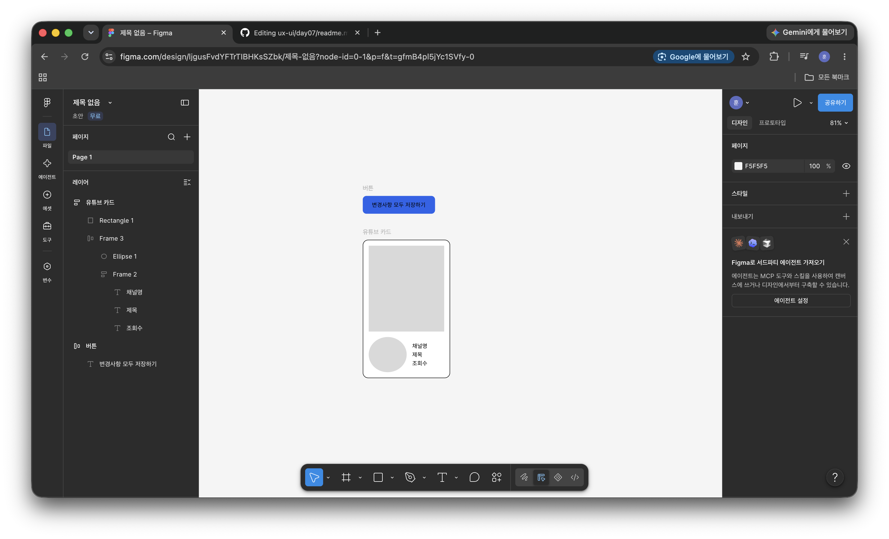

`day07`
# Day 07 - Figma 오토레이아웃
> 오늘 한 줄 : 피그마에서 오토레이아웃 설정방법, 오토레이아웃으로 카드 만드는 방법을 알게 되었다.

---

## 결과물



## 배운 것

### 1. 오토레이아웃 = Flexbox

- 오토레이아웃 단축키 `Shift + A`
- 요소를 자동으로 정렬,간격 배치해주는 기능

### 2. Hug/Fill/Fixed

- `Hug contents` : 내용물 크기에 맞춰 프레임이 줄어든다
  버튼에 사용. 텍스트가 '저장'에서 저장합니다'로 바뀌면 그만큼 버튼 크기도 커진다  
-`Fill container` : 부모의 남는 공간을 채웁니다.
  카드 안의 제목 텍스트, 검색창처럼 늘어나야 하는 요소에 씁니다.
- `Fixed` : 고정 크기
  아바타, 아이콘처럼 절대 변하지 않아야 하는 것에만 씁니다.

- 예시
  ```
  카드 (세로 오토레이아웃, gap 12)
  ├── 썸네일 (Fixed 높이, Fill 너비)
  └── 정보 블록 (가로 오토레이아웃, gap 12)
    ├── 채널 아바타 (Fixed 36x36)
    └── 텍스트 그룹 (세로 오토레이아웃, gap 4, Fill container)
        ├── 제목
        ├── 채널명
        └── 조회수 · 업로드 시간
  ```
> *gap 4 vs gap 12의 차이가 곧 근접성*이다.
> 제목, 채널명, 조회수는 `gap 4`로 촘촘히 묶어서 \'하나의 정보블록\'으로 읽히고, 카드끼리는 더 큰 `gap`으로 떨어져있어 서로 구분ㄴ되게한다


### 중첩이 기본

- 오토 레이아웃 안에 오토레이아웃을 넣는게 정상이다.
- 위 예시도 세로안에 가로, 그 안에 다시 세로가 들어간다.
- 만들 때 내부의 가장 작은 것부터 외부 제일 큰 방향으로 제작을 한다
- ex) 내부의 텍스트 -> 프로필 -> 썸네일 이 순으로 오토레이아웃을 설정한다.
