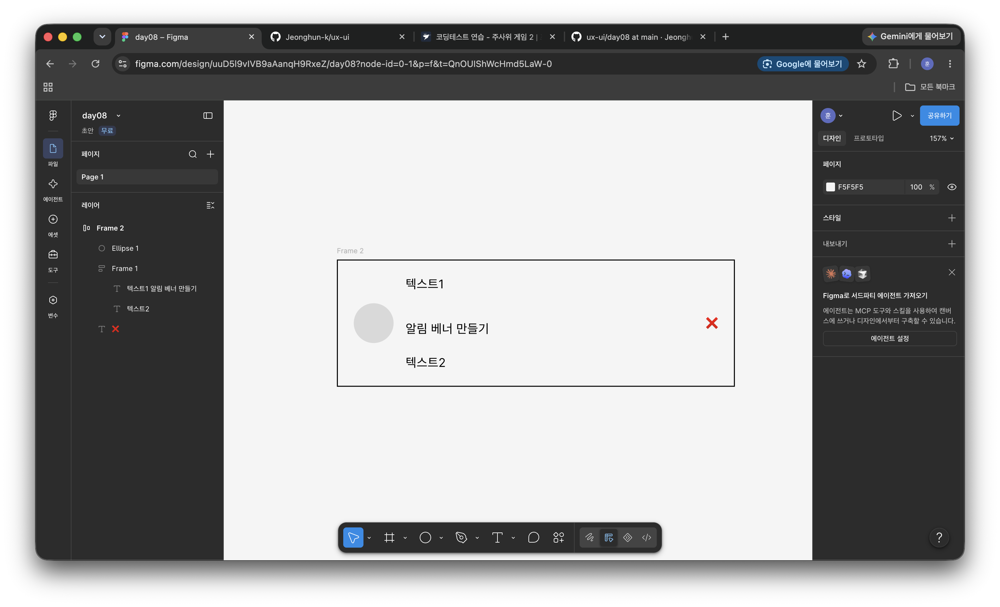

`day08`
# Day 08 - Figma 오토레이아웃 추가 실습
> 오늘 한 줄 : day07에서 조금 부족했던 fill/hug부분을 한 번 더 실습 진행하였다.

---

## 결과물


## 배운 것

### 1. 텍스트의 높이 만큼 전체 프레임 높이 변화

- 텍스트에 여러줄이 생성 되었을 때 텍스트를 감싸는 프레임의 높이를 증가 시키려면 프레임으로 선택된 모든것의 h를 fill로 전환해야된다.

### 2. 핵심 : 오토 레이아웃 flexbox 대응표

| Figma | CSS |
|---|---|
| 오토레이아웃 적용 (`Shift + A`) | `display: flex` |
| 흐름: 세로 / 가로 | `flex-direction: column / row` |
| gap | `gap` |
| padding | `padding` |
| 정렬 9칸 그리드 | `justify-content` + `align-items` |
| **Fixed (고정)** | `width: 240px` |
| **Hug (내용에 맞게 조절)** | `width: fit-content` |
| **Fill (컨테이너 채우기)** | `flex: 1` / `width: 100%` |

### 3. Fixed / Hug / Fill - "누가 크기를 정하는가"

- **Fixed** : 내가 정함
- **Hug** : **내용(자식)** 이 정함
- **Fill** : **부모** 가 정함

> 오늘 실습에서 부모는 Frame2이다.
> Frame2의 w를 400으로 맞췄기 때문에 텍스트를 fill(컨테이너 채우기)로 되어있어 부모 w에서 남는 공간을 가져간다.
> 그래서 텍스트를 늘리게되면 폭이 고정되어있어서 줄바꿈이 일어나고 그로인에 세로로 늘어나게 된다.

> 텍스트를 Hug로 정할 시 내용이 폭을 정하기 때문에 옆으로 카드 경계를 넘어서 늘어나게 된다

## 실습 - 알람 베너 제작

### 구조
```
바깥 프레임 (가로 400 고정 / 세로 Hug)
└── 가로 오토레이아웃 (gap 12, padding 16, 세로 중앙 정렬)
    ├── 원형 아이콘 40×40      → Fixed
    ├── 텍스트 묶음            → 가로 Fill
    │   └── 세로 오토레이아웃 (gap 4, 세로 Hug)
    │       ├── 제목
    │       └── 설명
    └── X 버튼                 → Hug
```

### 만든 순서

1. 원, 텍스트2개, x 텍스트를 각각 생성
2. 텍스트 2개 선택 -> `shift + A` -> **세로** 흐름, gap 4
3. 원, 텍스트 묶음, X텍스트 전체 선택 -> `shift + A` -> **가로**흐름, gap 12, padding 16
4. 가운데 텍스트 묶음의 w(가로) Fill로 지정, 원, X는 **Fixed / Hug** 지정
5. 정렬 9칸 그리드에서 **세로 중앙** 선택
6. 바깥 프레임 : 가로 400 Fixed, **세로 Hug** 선택

## 오늘 결론

- 넘침 : **Hug 체인이 끊긴 것**, 부모부분을 확인해보자
- 가로 Fill + 세로 Hug는 기본값처럼 사용해도된다.
