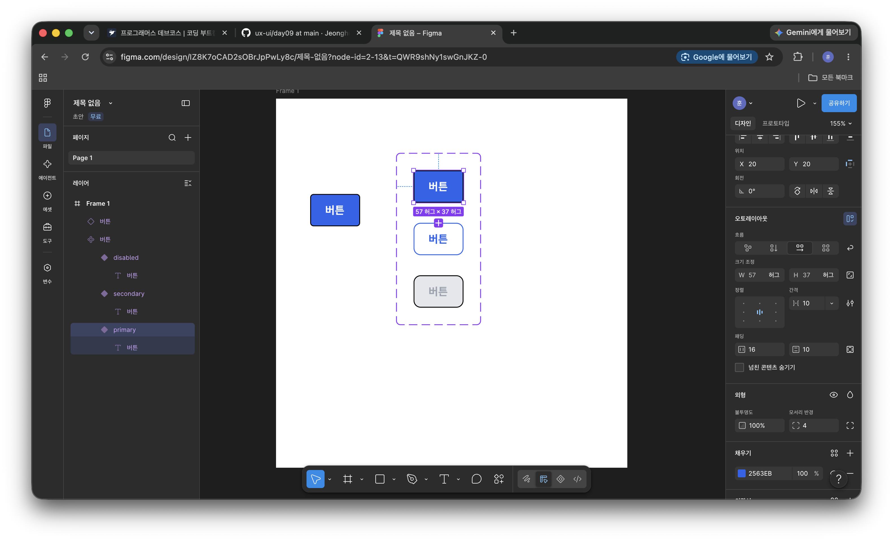

# Day 09 — Figma 컴포넌트(Component)와 배리언트(Variants)

> 2026-08-03 · 2단계 Figma
> UX/UI 학습 기록 — 디자인 감각 있는 프론트엔드 개발자 되기

---

## 결과물


## TL;DR

- **컴포넌트 = 함수 선언**, **인스턴스 = 함수 호출**
- **배리언트 = 컴포넌트에 props를 추가한 것**
- 메인을 고치면 모든 인스턴스가 따라온다. 인스턴스에서의 수정은 `override`(props 덮어쓰기)일 뿐이다.

```jsx
// Figma에서 오늘 만든 것을 코드로 번역하면
function Button({ type }) { ... }        // 메인 컴포넌트 ◈
<Button type="primary" />                // 인스턴스 ◇ + 배리언트 속성
```

---

## 1. 컴포넌트 (Component)

### 개념

| Figma | 코드 |
|---|---|
| 메인 컴포넌트 | 함수/클래스 **선언** |
| 인스턴스 | 함수 **호출** |
| 인스턴스에서 텍스트·색 변경 | **props로 덮어쓰기 (override)** |
| 메인 컴포넌트 수정 | 선언부 수정 → 모든 호출부에 반영 |

메인 컴포넌트를 수정하면 화면 어디에 흩어져 있든 모든 인스턴스가 동시에 바뀐다.
버튼 하나 색을 바꾸려고 화면 40개를 손보는 것과, 마스터 하나만 고치는 것의 차이가 여기서 갈린다.

### 만들기

```
⌥ ⌘ K        컴포넌트 만들기 (Create component)
```

또는 우클릭 → `컴포넌트 만들기`, 상단 툴바의 ◈ 아이콘.

> ⚠️ 여러 개를 한꺼번에 선택하고 `⌥⌘K`를 누르면
> **셋을 통째로 감싼 컴포넌트 1개**가 만들어진다. 반드시 하나씩 실행할 것.

---

## 2. 배리언트 (Variants)

### 개념

같은 컴포넌트의 **여러 상태**를 하나의 `component set`으로 묶고, 속성으로 전환하는 기능.

```jsx
// 배리언트 속성 = props 인터페이스
<Button type="primary" size="md" state="hover" />
//        └──────┴─────┴──────── 이 이름들이 그대로 Figma의 Variant properties
```

**흔한 오해**: 아무 컴포넌트나 묶는 게 아니다.
버튼과 카드를 묶는 건 의미가 없고, **같은 컴포넌트의 변형**만 묶는다.

### 만들기

1. 메인 컴포넌트 여러 개 선택
2. **우측 사이드바** → `배리언트로 결합` (Combine as variants)
3. 결과: 보라색 **점선 박스** = component set

> 최신 Figma(UI3)에서는 이 메뉴가 **우클릭이 아니라 우측 사이드바**에 있다.
> 대안 경로: 좌측 상단 Figma 아이콘 → `개체(Object)` → `배리언트로 결합`

### 더 쉬운 방법 (권장)

메인 컴포넌트 1개만 만든 뒤,
우측 패널 `속성(Properties)` 옆 **`+` → `배리언트`** 를 누르면
Figma가 알아서 component set을 만들고 배리언트를 복제해준다. 결합 과정이 필요 없다.

### 네이밍

레이어 이름을 슬래시로 지으면 속성/값이 자동 정리된다.

```
Button/Primary
Button/Secondary
Button/Disabled
```

→ 속성 `Type`, 값 `Primary / Secondary / Disabled`

이름을 안 맞추면 `Property 1`, `Default`, `Variant2` 같은 무의미한 이름이 생겨서 전부 손으로 고쳐야 한다.
**이 이름이 나중에 React 컴포넌트의 props가 되므로 처음부터 영문으로 짓는 게 좋다.**

### 기본 배리언트

Assets 패널에서 꺼냈을 때 나오는 기본값은
**component set 안에서 가장 왼쪽 위에 있는 배리언트**다. (레이어 순서가 아니라 캔버스 위치 기준)

드롭다운 표시 순서는 알파벳순이라 `disabled → primary → secondary`처럼 나온다.
순서를 고정하려면 접두사 번호를 붙이는 방법이 있다.

```
1-Primary
2-Secondary
3-Disabled
```

---

## 3. 레이어 아이콘 판별법

오늘 가장 많이 헤맨 지점. **아이콘만 보면 즉시 판별할 수 있다.**

| 아이콘 | 정체 | 배리언트 결합 |
|---|---|---|
| `#` 회색 | 일반 프레임 | ❌ |
| `\|]o` | 오토레이아웃 프레임 | ❌ |
| ◇ 빈 마름모 1개 | **인스턴스** | ❌ |
| ◈ 마름모 4개 (보라) | **메인 컴포넌트** | ✅ |
| ◈ + 점선 박스 | component set (완성형) | — |

### 인스턴스가 생기는 경로

| 동작 | 결과 |
|---|---|
| 캔버스의 ◈ 선택 → `⌘ D` | 메인 컴포넌트 ◈ |
| 캔버스의 ◈ 선택 → `⌘ C` → `⌘ V` | 메인 컴포넌트 ◈ |
| **Assets 패널에서 드래그** | **인스턴스 ◇** |

> 배리언트로 묶으려면 **메인 컴포넌트**가 필요하다.
> Assets에서 꺼낸 인스턴스로는 결합이 불가능하다.

---

## 4. 실습 — Button 컴포넌트 세트

### 결과물

| 배리언트 | 배경 | 텍스트 | 비고 |
|---|---|---|---|
| Primary | `#2563EB` | `#FFFFFF` | Semi Bold |
| Secondary | 없음 | `#2563EB` | 1px 테두리 `#2563EB` |
| Disabled | `#E5E7EB` | `#9CA3AF` | — |

### 왜 Disabled에 opacity 50%를 안 쓰는가

투명도를 쓰면 뒤 배경색이 비쳐서 배경이 어두운 곳에 놓았을 때 색이 예측 불가능해진다.
실무에서는 **비활성 상태 전용 색을 따로 지정**하는 쪽이 표준이다.

### 검증 방법

1. Assets 패널에서 인스턴스를 캔버스로 드래그
2. 우측 패널의 `Type` 드롭다운으로 `Primary ↔ Secondary ↔ Disabled` 전환 → 모양이 즉시 바뀌면 OK
3. **component set 안의 Primary 원본**의 코너 반경을 `8 → 4`로 변경
   → 멀리 떨어뜨려 놓은 인스턴스도 같이 바뀌면 성공

3번이 컴포넌트를 쓰는 이유 그 자체다.

---

## 5. 트러블슈팅 (실제로 막혔던 것들)

### `배리언트로 결합` 메뉴가 안 보인다

**원인**: 선택 항목에 인스턴스(◇)나 일반 프레임(`#`)이 섞여 있음.
우클릭 메뉴에 `인스턴스 분리` / `인스턴스 재설정` 이 보이면 인스턴스가 섞였다는 신호다.

**해결**:

```
⌥ ⌘ B        인스턴스 분리 (Detach instance) → 일반 프레임으로 환원
⌥ ⌘ K        하나씩 컴포넌트로 승격
→ 그 다음 우측 사이드바에서 배리언트로 결합
```

인스턴스 분리에 성공하면 아이콘이 `◇` → `|]o`(오토레이아웃 프레임)으로 바뀐다.

### 컴포넌트가 만들어졌는지 모르겠다

- 레이어 아이콘이 **보라색 ◈** 인지 확인
- 좌측 **Assets 패널**에 등록되면 성공 신호다 (컴포넌트는 Assets에 자동 등록됨)

### 색을 바꿨는데 3개가 같이 바뀐다

인스턴스를 복제한 것. 캔버스의 메인(◈)을 `⌘ D`로 복제해야 한다.

### 테두리를 넣으니 버튼 크기가 커진다

Stroke 위치를 `Center` → **`Inside`** 로 변경.

### 잠긴 레이어

레이어 오른쪽 **자물쇠 🔒 아이콘 클릭**으로 해제. 잠긴 상태면 선택도 컴포넌트화도 안 된다.

---

## 6. 단축키 정리 (macOS)

| 단축키 | 기능 |
|---|---|
| `⌥ ⌘ K` | 컴포넌트 만들기 |
| `⌥ ⌘ B` | 인스턴스 분리 (Detach) |
| `⌘ D` | 복제 |
| `⌥ 1` / `⌥ 2` | 레이어 패널 / Assets 패널 전환 |
| `⇧ I` | 리소스(컴포넌트) 검색창 |
| `⇧ A` | 오토레이아웃 추가 |
| `Enter` | 선택한 프레임의 자식으로 진입 |
| `Esc` | 상위 레이어로 빠져나오기 |

> 단축키가 안 먹으면 **한글 입력 상태를 영문으로** 바꾸고 다시 시도.

---

