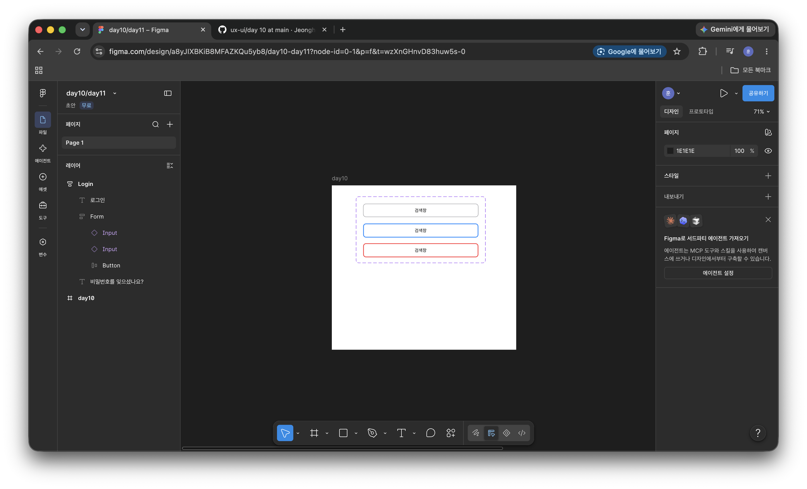

`day10`
# Day 10 - 컴포넌트, 베리언트 추가 예제

> Day 09에서 부족한 부분을 한번 더 짚고 넘어가기위해 같은 내용의 실습을 한번 더 진행함

---

## 결과물


## 배운 것

Figma의 컴포넌트는 React의 컴포넌트와 거의 1:1로 대응된다

| Figma | React |
|---|---|
| 마스터 컴포넌트 (◆) | 함수 정의 |
| 인스턴스 (◇) | 함수 호출 |
| 배리언트 | props로 받는 값 |
| 컴포넌트 세트 (◈, 보라 점선) | 같은 시그니처를 공유하는 묶음 |

```jsx
// Figma 컴포넌트 세트 = 이 함수 하나
function Input({state}){...}

<Input state = "default" /> // 인스턴스1
<Input state = "focus" />  // 인스턴스2
<Input state = "error" />  // 인스턴스3
```

### 핵심 포인트
베리언트 이름은 `속성명=값` 형태로 지어야된다. `State=Default`처럼 쓰면 Figma가
자동으로 드롭다운을 만들어주지만, `버튼1`로 지으면 그냥 이름일 뿐 속성이 생기지 않는다

** 이름이 곧 API다.**

---

## 만든 것 - Input컴포넌트 세트

검색창 입력 필드의 3가지 상태를 베리언트로 구현했다

```
◈ Input                     ← 컴포넌트 세트
   ├ ◆ State=Default        회색 테두리 1px
   ├ ◆ State=Focus          파란 테두리 2px
   └ ◆ State=Error          빨간 테두리 2px
```

### 상태별 의미

 상태 | 대응하는 CSS | 언제 보이나 |
|---|---|---|
| Default | `input { }` | 평소 |
| Focus | `input:focus { }` | 클릭하거나 Tab으로 이동했을 때 |
| Error | `input.error { }` | 유효성 검사에 실패했을 때 |


## 트러블 슈팅

### 복제하면 인스턴스가 된다

마스터 컴포넌트를 `Ctrl + D`로 복제하면 마스터가 아니라 **인스턴스**가 생긴다.
인스턴스끼리는 `Combine as variants`로 묶을 수 있다.

- 해결: 보게ㅈ하지 말고 `Properties`의 `+` -> `Variant`를 쓴다.
- 굳이 복제본을 살리려면: `Detach instance` (Ctrl+Alt+B) -> `Create component` (Ctrl+Alt+K) -> `Combine as variants`

### 컴포넌트 이름은 두 층으로 나뉜다

배리언트를 추가하면 원래 이름이 바깥 세트로 올라가고, 안쪽 자식들은 임시 이름을 받는다.
세트 이름은 `Frame 2`와 같은 기본값으로 두면 나중에 에셋 패널에서 검색이 안 된다.


```
◈ Input              ← 세트 이름. 함수명에 해당
   ├ ◆ State=Default  ← 배리언트 이름. props 값에 해당
```

### 마름모 아이콘 구분
| 아이콘 | 의미 |
|---|---|
| 채워진 보라 마름모 | 마스터 컴포넌트|
| 빈 마름모 | 인스턴스 |
|보라 점선 테두리 | 컴포넌트 세트|

---

