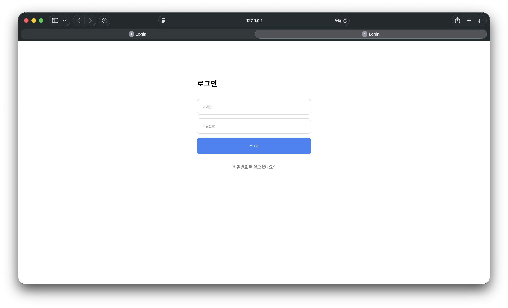

`day12`
# Day 12 - Flexbox
> Day11에서 제작한 로그인 화면을 실제 html,css로 옮겨오기

## 결과물

---

## 배운 것

### Figma와 CSS의 대응 표
| Figma 우측 패널 | CSS | 
|---|---|
|오토레이아웃 적용 | display : flex|
| 흐름 세로/가로 | flex-direction: column / row |
| 간격 32 | gap : 32px |
| 패딩 120/24/24 | padding: 120px 24px 24px |
| 정렬 3x3격자 | justify-content + align-items |
| 고정 402 | width : 402px|
| 콘텐츠 감싸기 | width: fit-content |
| 컨테언 채우기 | width: 100% 또는 flex: 1 |

### `gap`, `flex-direction`, `display: flex`의 관계

`gap`과 `flex-directon`은 `display: flex`로 설정하지 않으면 화면에 적용이 되지 않는다.

### flex

flex는 **"이 박스 안의 자식들을 한 줄로 세워라"** 라는 명령이다.  
기본은 세로로 요소들이 쌓이게 되지만 display: flex를 사용하면 기본값인 row로 인해 가로로 쌓이게 되고
flex-direction: column을 하게되면 세로로 쌓이게 된다.  

- 장점 : gap으로 간격을 한 번에 관리한다.

## 막힌점 

### 1. Form 부분이 오토레이아웃 설정이 안되어있음

**원인** - Form태그가 오토레이아웃으로 설정이 되어있지 않아 Form태그 안의 요소들의 정렬이 제대로 이루어지지 않았음.  
**해결** - Form태그의 style안에 display: flex 속성을 넣어 오토레이아웃으로 재설정시킴
