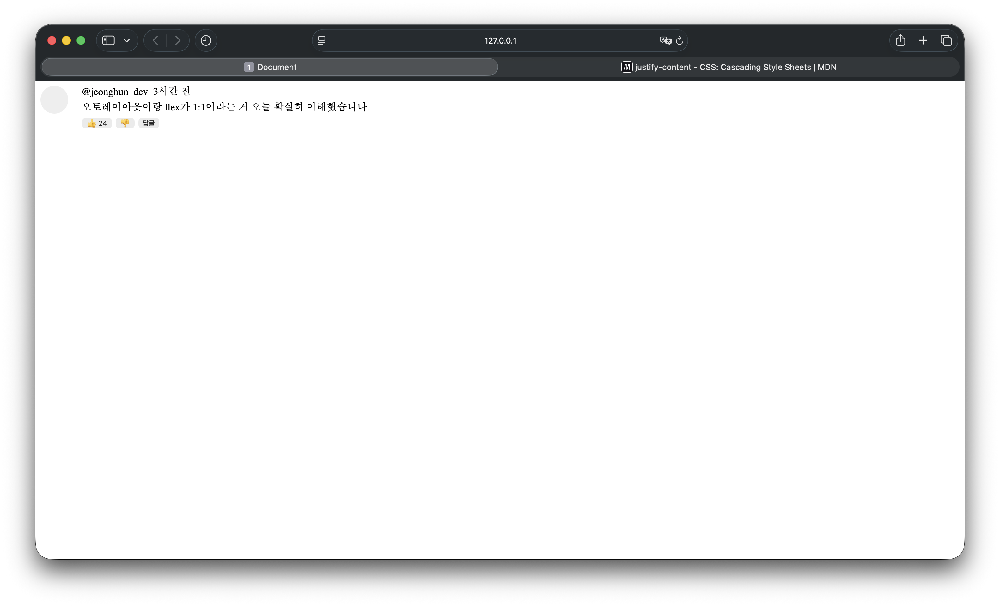

`day13`

# Day 13 - 복습
> Day12의 내용 복습
> display: flex에 대한 내용을 확실하게 한 번 더 짚고 넘어가기

---

## 결과물

---

## 배운 것

### flex를 사용 시 부가적인 기능

- flex를 사용하면 gap align-items등을 사용할 수 있게 된다. -> display: flex;를 하지 않으면 이런것도 사용이 불가능하다.
- flex 사용 시 사용 가능한 것들

| 흐름 방향으로 정렬 | 흐름 방향 반대방향으로 정렬 | 요소 사이 간격 | 흐름 |
|---|---|---|---|
| justify-content | align-items | gap | flex-direction |

### 오토레이아웃은 중첩 된다.

- 피그마에서 오토레이아웃을 4번 감쌋다면 css에서도 동일하게 4번 감싸야된다
- 어떤 태그든 상관 없이 figma에서 오토레이아웃을 사용했다면 css에서도 flex를 사용해야된다.

---

## 막힌점

### 1. .comment에서 gap: 12px가 빠짐

**원인** - 코드에서 gap: 12px를 입력을 하지 않음
**해결** - gap: 12px 추가함

### 2. .text에서 margin이 gap: 6px를 덮음

**원인** - p태그가 기본으로 가지고있는 maring에 gap이 추가되어서 원하는 간격보다 더 많은 간격을 가지게됨
**해결** - margin: 0;을 추가해주므로써 p태그의 margin을 없애서 원하는 간격만 표현될 수 있게 한다.
